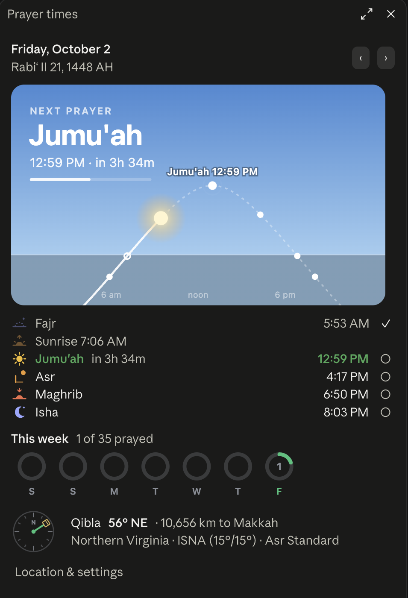

# Prayer times for Claude Code

A small Claude Code mod that keeps the next prayer in view while you work.

<p align="center"></p>

- **Under the prompt:** the next prayer, always, among the footer's labels. `Asr 4:18 PM`, or `Asr in 18 min` within the hour.
- **Above the prompt:** a quiet reminder from 15 minutes before adhan, then `Asr now` for 20 minutes after, with a Done button that also marks the prayer prayed. On Fridays Dhuhr is shown as Jumu'ah.
- **At adhan:** a notice and a soft chime (or a spoken reminder, or nothing). With several chats open, only one plays it.
- **`/prayer`:** a pane with the day at a glance:
  - **Today's sky.** The sun's real path across the day, coloured by where it is now (night, dawn, day, sunset), with each prayer marked where the sun stands at its time. The sun glows where it is; at night there are stars and the moon in its actual phase. Hover a prayer to see its time. The next prayer, its countdown and whose time it is now sit on top.
  - **The timetable,** each prayer with its own icon, and a ○ beside it to mark it prayed. Seven rings fill through the week as you do. What you mark stays on your machine.
  - **Other days,** with the ‹ and › arrows, and the Hijri date for each.
  - **The Qibla,** as a compass bearing from true north and the distance to Makkah. Macs have no compass sensor, so the needle shows the bearing rather than turning as you turn; line it up with north from your phone's compass or a known landmark.
  - **Location & settings,** for changing them from the pane, which is the only way in the desktop app, where `/config` does not open.

  In the terminal the pane is the same, drawn in text.

Everything is calculated on your machine. It makes no network requests and sends nothing anywhere.

## Install

You need a Claude Code version with mods (function hooks), in the terminal or the desktop app's Code tab.

```bash
claude plugin marketplace add mkbuilds4/mods
claude plugin install prayer-times@mkbuilds
```

Start a new chat and the next prayer appears under the prompt.

## Set your location

Out of the box it guesses from your time zone: New York for US Eastern, London for UK time, Cairo for Egypt, and so on, with the method most used there. For accurate times, set your own coordinates (find them by right-clicking your city in Google Maps):

```bash
echo '{"latitude":"40.71","longitude":"-74.01","place":"New York"}' | claude plugin configure prayer-times@mkbuilds --values-stdin
```

Or change them in `/config` inside Claude Code, or from **Location & settings** in the `/prayer` pane, which takes a city name (`Northern Virginia`, `Birmingham`, `Makkah`) or coordinates (`38.85, -77.31`). What you set in the pane wins over `/config`; **Use /config instead** clears it. All the settings:

| Setting | What it does | Default |
|---|---|---|
| `latitude`, `longitude` | Where to calculate for | guessed from your time zone |
| `place` | The name shown in `/prayer` | the guessed city |
| `method` | `ISNA`, `MWL` (Muslim World League), `Egyptian`, `UmmAlQura`, `Karachi`, or `auto` | `auto` (by region) |
| `asr` | `Standard` (Shafi'i, Maliki, Hanbali) or `Hanafi` | `Standard` |
| `sound` | `chime`, `voice`, or `off` | `chime` |

## How it calculates

It uses the standard astronomical method from [PrayTimes.org](http://praytimes.org):
- **Dhuhr:** solar noon, from the sun's declination and the equation of time.
- **Fajr and Isha:** when the sun sits the method's angle below the horizon.
- **Sunrise and Maghrib:** the sun at 0.833° below the horizon, to allow for refraction.
- **Asr:** when a shadow reaches the object's length (twice that for Hanafi), plus its noon shadow.

Daylight saving comes from your computer's clock for each date.

Checked against [aladhan.com](https://aladhan.com) for the same location and method across a winter, a summer and an autumn day: 16 of 18 times matched to the minute, and the other two were one minute apart. That's about how much masjid timetables differ from each other anyway. If your masjid publishes its own timetable, follow it. Iqamah times are your masjid's, not astronomy's, so the mod doesn't try to show them.

## Updating

```bash
claude plugin marketplace update mkbuilds
claude plugin update prayer-times@mkbuilds
```

Then start a new chat.

## Files

- `plugins/prayer-times/hooks/times.ts`: the calculation, with no Claude Code dependencies. Ported from PrayTimes.js, so it's under the LGPL (see License).
- `plugins/prayer-times/hooks/chime.ts`: the chime, synthesized as a WAV in code (no sound files).
- `plugins/prayer-times/hooks/art.ts`: the pane's pictures (the sky, the icons, the week's rings, the compass), as SVG built in code.
- `plugins/prayer-times/hooks/register.tsx`: the footer label, reminder, pane and adhan notice.
- `plugins/prayer-times/tests/render.test.tsx`: draws the pane on every surface and checks marking a prayer and setting a place (`claude plugin test plugins/prayer-times`).

## Changes

- **1.1.2:** README screenshot and update steps, and the calculation's LGPL license stated properly.
- **1.1.1:** No white boxes behind the pane's sky and rings in dark mode in the desktop app.
- **1.1.0:** The `/prayer` pane draws the day's sky, marks prayers prayed with a weekly tracker, and sets your place by city name or coordinates.
- **1.0.0:** The next prayer under the prompt, the reminder, the adhan chime and the timetable.

## License

The mod is [MIT](../../LICENSE), with one exception. The prayer time calculation, `plugins/prayer-times/hooks/times.ts`, is ported from [PrayTimes.js](http://praytimes.org) by Hamid Zarrabi-Zadeh and stays under the original's [GNU LGPL v3.0](LICENSES/LGPL-3.0.txt). You can use, change and share it freely; if you share a changed version of that file, keep it under the LGPL and keep the credit. Thanks to PrayTimes.org for publishing the method and the code that so many prayer apps are built on.

Made by [MK Builds](https://mkbuilds.dev).
